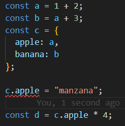

**Explicación**
El error ocurre porque TypeScript infiere que c.apple es de tipo number porque se inicializó con a, que es 1 + 2.
Al intentar asignarle un valor de tipo string, TypeScript lanza un error: no se puede asignar un string a una propiedad que espera un número.
Además, la línea const d = c.apple * 4 se vuelve inválida, porque estaría intentando multiplicar una cadena por un número.

**Ventajas de TypeScript**
- Detecta errores de tipo antes de ejecutar el código.
- Protege la coherencia de los datos en estructuras como objetos.
- Facilita el mantenimiento y la escalabilidad del código.

1. **Para cada uno de los valores del fichero code2.ts, ¿Qué tipo de datos inferirá TypeScript? Explica por qué se ha inferido este tipo de datos.**

2. **¿Por qué se dispara cada uno de los errores del fichero code3.ts?**

3. **¿Cuál es la diferencia entre una clase y una interface en TypeScript?**

